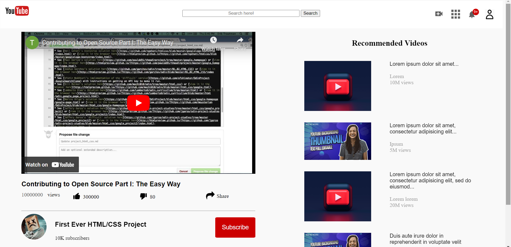

# Project Media

> This first assignment require to draw on our new understanding of working with media by building YouTube's video player page. The goal here isn't to produce an exact replica of the YouTube video page, but to focus on making the media elements show up. That means two things -- embedding the YouTube video player into the page so it actually plays and showing little thumbnail images along the right side.

## Built With

- HTML and CSS
- without any extra css library

## Author

👤 

- Github: [@mailsg](https://github.com/mailsg)

## 🤝 Contributing

Contributions, issues and feature requests are welcome!

Feel free to check the [issues page](issues/).

## Show your support

Give a ⭐️ if you like this project!

## 📝 License

This project is [MIT](lic.url) licensed.